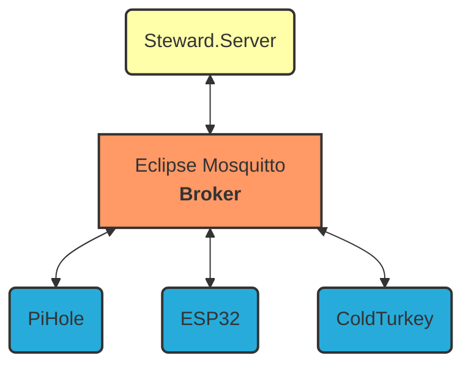
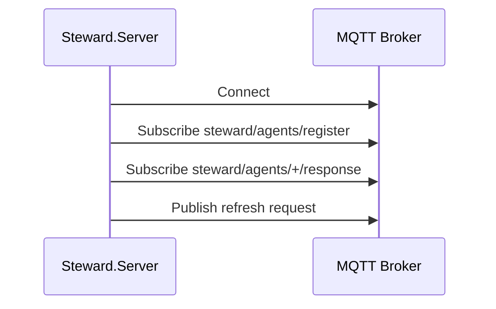
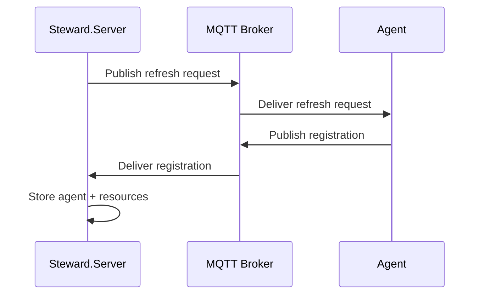
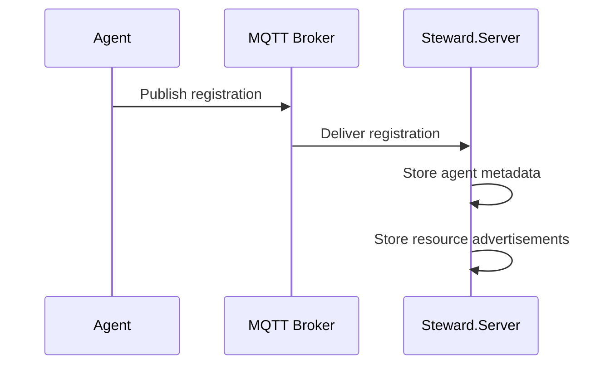
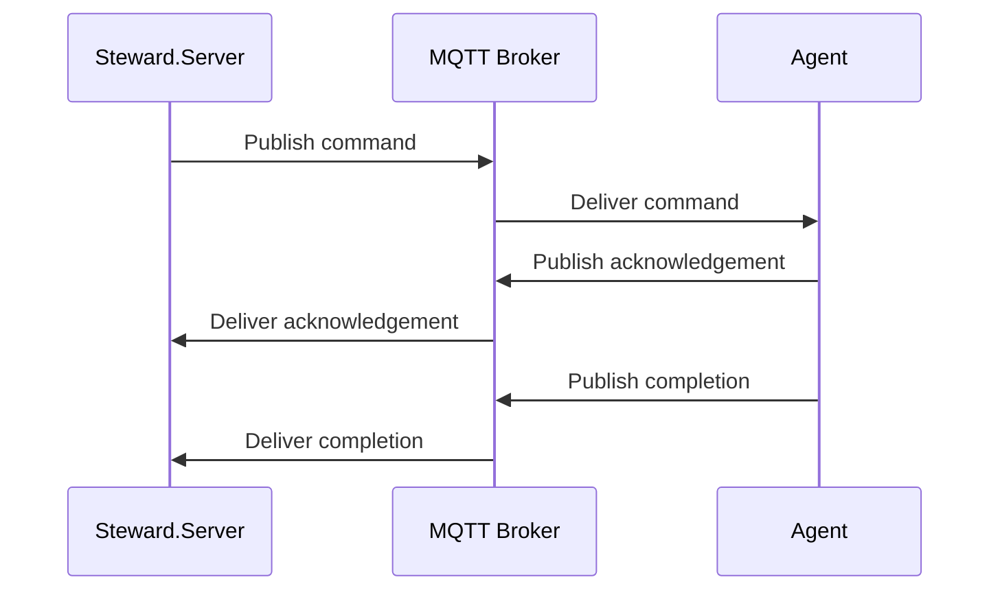

# MQTT
## Network
* The broker, a containerized `eclipse-mosquitto` (orange), negotiates the connection between various clients.
* One client, the Steward.Server (yellow), is the source of truth, command, and control. 
* All other clients are agents (blue), and effectuate the commands of the server.



## Conversations
1. Server Initialization
    - Server connects to broker
    - Server subscribes to agent topics
    - Server begins the `Refresh Agents` flow
1. Refresh Agents
    - Server sends a call to refresh 
    - Agents respond with the `Agent Registration` flow
    - Server stores each agent and its resources
1. Agent Registration
    - Agent announces itself
        - Including an advertisement of its manageable resources
1. Policy Execution
    - Server sends command
    - Agent acknowledges request
    - Agent reports completion

### Server Initialization
When Steward.Server starts, it establishes communication with MQTT and begins discovery.

The server does not know what agents exist. It asks. The `+` wildcard means all agent responses are received (esp32, pihole, etc).



#### Topics
`steward/agents/register`

``steward/agents/+/response``

``steward/agents/refresh``

### Refresh Agents
Ask all agents:

> "Tell me who you are and what you can do."

This lets Steward recover after:
- restart
- database restore
- new agent installation



#### Topics
`steward/agents/refresh`

`steward/agents/register`

### Agent Registration

An agent announces:
* who it is
* what it can manage

This is the foundation of your earlier idea:
> Enforcers advertise what exactly they can block.



#### Example
Topic: `steward/agents/register`

```json
{
  "agentId": "pihole-home",
  "name": "Home Pi-hole",
  "resources": [
    {
      "id": "youtube",
      "name": "YouTube",
      "actions": [
        "block",
        "unblock"
      ]
    }
  ]
}
```

### Policy Execution
Tell an agent to perform an action.

Example:
> Block YouTube until 8 PM.



#### Examples
Topic: `steward/agents/pihole-home/command`

Payload:
```json
{
  "requestId": "abc123",
  "action": "block",
  "resource": "youtube",
  "expires": "2026-07-12T02:00:00Z"
}
```

Topic: `steward/agents/pihole-home/response`

Payload:
```json
{
  "requestId": "abc123",
  "status": "completed"
}
```

## Topics

MQTT topics are organized around the Steward domain. The server acts as the source of truth and command authority, while agents publish their identity, capabilities, status, and execution results.

```
steward/
├── server/
│   └── status
│
└── agents/
    ├── refresh
    ├── register
    │
    └── {agentId}/
        ├── command
        ├── response
        └── status
```

### Server Topics

| Topic                   | Publisher      | Subscriber | Purpose                    |
| ----------------------- | -------------- | ---------- | -------------------------- |
| `steward/server/status` | Steward.Server | Agents     | Server availability status |

### Agent Discovery Topics

| Topic                     | Publisher      | Subscriber     | Purpose                                     |
| ------------------------- | -------------- | -------------- | ------------------------------------------- |
| `steward/agents/refresh`  | Steward.Server | All agents     | Requests agents to announce themselves      |
| `steward/agents/register` | Agents         | Steward.Server | Agent identity and capability advertisement |

### Agent Communication Topics

The `{agentId}` segment identifies the target agent.

Example:

```
steward/agents/pihole-home/command
```

| Topic                               | Publisher      | Subscriber     | Purpose                                                     |
| ----------------------------------- | -------------- | -------------- | ----------------------------------------------------------- |
| `steward/agents/{agentId}/command`  | Steward.Server | Agent          | Requests an action                                          |
| `steward/agents/{agentId}/response` | Agent          | Steward.Server | Acknowledges or reports command completion                  |
| `steward/agents/{agentId}/status`   | Agent          | Steward.Server | Reports connection state using MQTT Last Will and Testament |

### Wildcards

Steward.Server commonly subscribes using MQTT wildcards.

Example:

```
steward/agents/+/response
```

The `+` wildcard matches one topic segment:

```
steward/agents/pihole-home/response
steward/agents/esp32-bedroom/response
steward/agents/coldturkey-pc/response
```

This allows Steward.Server to communicate with any registered agent without requiring prior knowledge of every agent ID.


## Agent Lifecycle

Agents use MQTT Last Will and Testament (LWT) to communicate connection status.

When an agent connects, it publishes an online status message. If the agent disconnects unexpectedly, the MQTT broker automatically publishes an offline status message on its behalf.

This allows Steward.Server to track agent availability without periodic polling.

Example topic:

```
steward/agents/{agentId}/status
```
